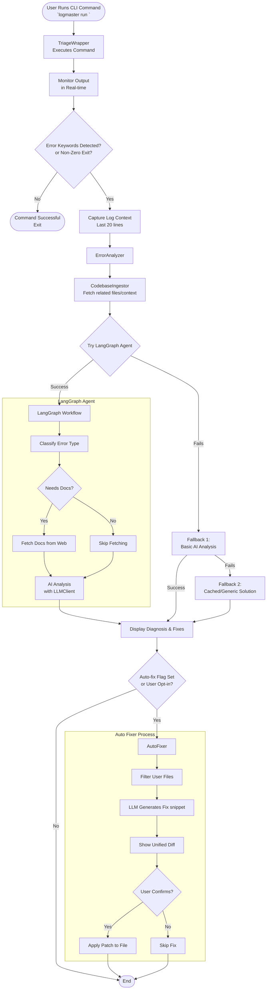

# Ai Log Master - Workflow Diagram

This document contains the execution flow of the `Ai_log_master` application from the entry point down to error analysis and auto-fixing.

## Execution Flow

## Key Components

1. **CLI (`cli.py`)**: The entry point which parses arguments and wraps the execution using `TriageWrapper`.
2. **TriageWrapper**: Streams terminal output and looks for error indicators (keywords or exit codes).
3. **ErrorAnalyzer (`core/analyzer.py`)**: The main orchestrator that manages the fallback chain (LangGraph Agent -> Basic AI -> Pattern Matching).
4. **Agent (`core/agent.py`)**: A LangGraph state machine that intelligently classifies the error, fetches relevant documentation from the web if necessary, and then invokes the LLM.
5. **CodebaseIngestor (`core/ingestor.py`)**: Parses the stack trace to fetch the user's local code files, providing the LLM with deeper context.
6. **AutoFixer (`core/auto_fixer.py`)**: Prompts the LLM to rewrite the faulty code block, generates a safe diff, and writes it back to disk upon user confirmation.
